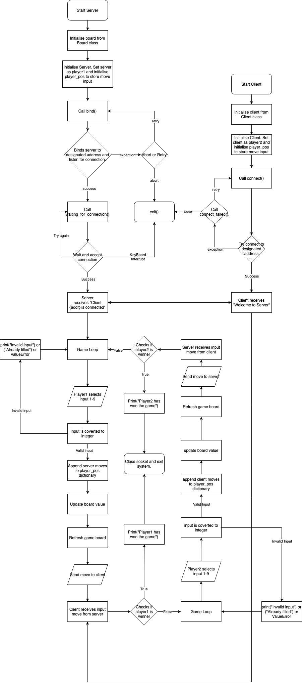

# Develop and Implement an Algorithm in Python

1. Develop and describe an algorithmic solution for an application that utilises two way communication over a network (300 - 500 words)

Tic Tac Toe Network game is a simple two player game over the network. The server is default to player 1 and the client is defaulted to player 2. A Server class and Client class has been initialised in two separate files and a separate Board class python file has been created to handle the game board and checks for a winner or tie. Both the Server file and client file have server and client instance object created respectively. In both files, the board instance was created with Board class object. Class attributes of server_socket, HOST, PORT, and ADDRESS = (HOST, PORT) were also created. The moves of the players are stored in the class attribute "self.player_pos". Python dependencies used included importing socket, time and sys. 'Board' class was also imported from grid.py file. Note: the time module was implement in the Server file only.

The Server file should be opened first. The Server class attribute bind() will immediately be called upon when an instance object is given to server = Server() and board = Board(). It'll bind to the given host and port then listens for a client. The method waiting_for_connection is then called and waits for a connection to be establised. If user exits program by pressing ctrl + c, error handling is implemented to catch the KeyboardInterrupt error. Once the server accepts and connects to the client, the game will start. A try and except block has been utilised in the binding method, sending method and receiving method to catch any errors with regards to creating the initial connection with the client. 

Upon the starting the game loop, the terminal clears the screen and the Server will player1 to choose a position from 1 to 9. This move is stored as a string and then another variable "move_int" is created to store the integer version of the data. As a handling error, the game then checks the move_int for wrong inputs, including numbers not between 1 to 9, if the board has already been filled and ValueError exception. Once validated, the move is appended in the list in a dictionary as a key:value pair in the class attribute "player_pos" under 'X' for server. The Server board then gets updated, refreshed on the server side and then the string version of the data is sent over the sockets. At this point, the program checks if the server has won or tied then breaks the loop and waits for receiving message from the Client if no winner or not tied. 

Another try and except block has been setup upon receiving the message, and if successful  another variable is created to store the move as an integer. The try and except block captures any ValueError or KeyboardInterrupt errors. Server receives the clients move then appends the move in player_pos 'O' and the board gets updated then refreshed on the server side. Winner is checked on the server side to see if client has won otherwise, program goes back to game loop.

On the client algorithm, it is firstly waiting to receive a move message from the Server. Like Server, the move is stored as a string and another variable "move_int" is stored as an int. A try and except block has also been included to capture any error associated again with ValueError or KeyboardInterrupt error. The move is appended to the list in the dictionary on the Client side and checks if the server has made a winning move or drawn. Note: server does not check for a tie when a client sends the move because the Client will always have one move less than the Server. 

Otherwise game loop on client end begins. the terminal clears the screen and the Server will player1 to choose a position from 1 to 9. This move is stored as a string and then another variable "move_int" is created to store the integer version of the data. As a handling error, the game then checks the move_int for wrong inputs, including numbers not between 1 to 9, if the board has already been filled and ValueError exception. Once validated, the move is appended in the list in a dictionary as a key:value pair in the class attribute "player_pos" under 'O' for server. The Client board then gets updated, refreshed on the client side and then the string version of the data is sent over the sockets. At this point, the program checks if the client has won then breaks the loop and waits for receiving message from the server if no winner.

2. Develop a flowchart for an application that outlines the control flow of the app, and illustrates the operation of an algorithm based on the solution you have described.

